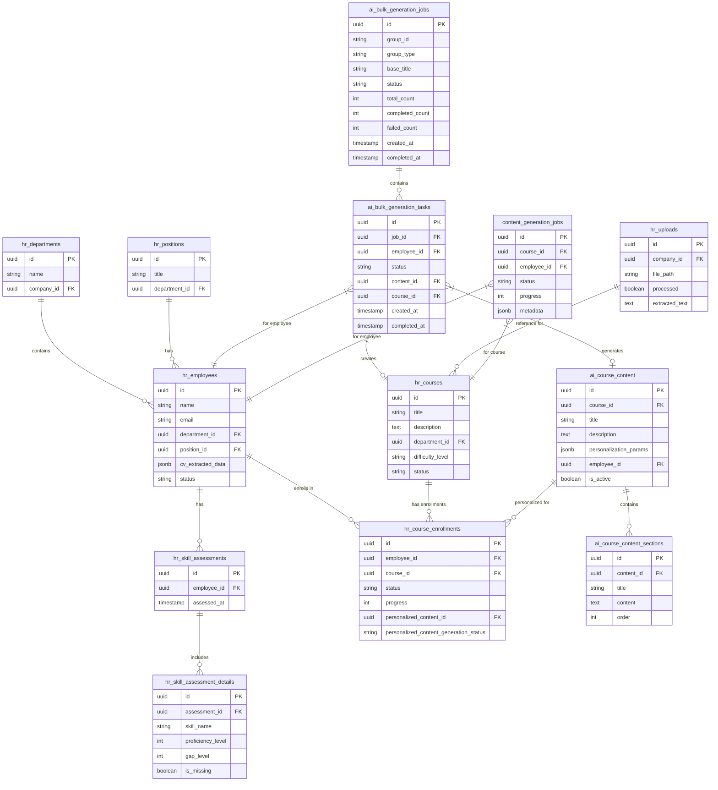
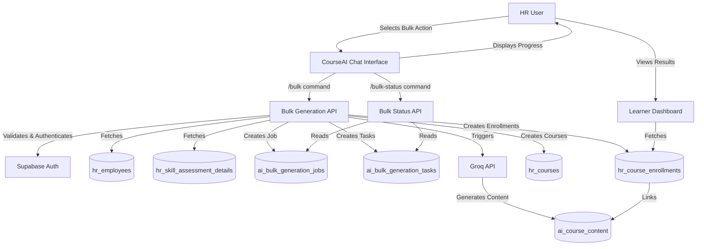

# CourseAI Bulk Actions Upgrade Blueprint

## 1. Overview

This blueprint details the upgrade of CourseAI to support **bulk actions**—enabling HR users to generate, assign, and manage personalized course content for large groups (e.g., departments, positions) efficiently. The plan leverages your existing infrastructure, prioritizes security, scalability, and maintainability, and follows best practices for both frontend and backend.

---

## 2. Tech Stack

### **Frontend**

- **React (with Vite)**
  - *Why*: Fast, modern SPA framework; Vite enables rapid development and HMR.
- **TypeScript**
  - *Why*: Type safety, better maintainability, and fewer runtime errors.
- **shadcn/ui & Tailwind CSS**
  - *Why*: Consistent, accessible UI components; utility-first styling for rapid, maintainable design.
- **Zod**
  - *Why*: Runtime validation of user input and API responses.

### **Backend**

- **Vercel Serverless Functions (Node.js, TypeScript)**
  - *Why*: Scalable, cost-effective, and easy to deploy; fits with Vercel hosting.
- **Supabase (Postgres, Storage, Auth)**
  - *Why*: Managed, scalable database and storage; built-in authentication and RLS for security.
- **Groq API**
  - *Why*: AI-powered content generation for personalized learning.
- **Resend, React Email**
  - *Why*: Transactional email for notifications and status updates.

### **Supporting Technologies**

- **Turborepo**
  - *Why*: Monorepo management for shared code and streamlined builds.
- **ESLint & Prettier**
  - *Why*: Enforce code quality and consistent formatting.
- **pnpm**
  - *Why*: Fast, disk-efficient package management.

---

## 3. Database Structure Flowchart



---

## 4. App Flowchart



---

## 5. Implementation Plan

### **Phase 1: Database & API Foundation (1 week)**

- **Tasks:**
  1. Add `ai_bulk_generation_jobs` and `ai_bulk_generation_tasks` tables (with migrations).
  2. Add indexes on `employee_id`, `job_id`, and status columns.
  3. Implement `/api/courses/bulk-generate` (POST) and `/api/courses/bulk-status` (GET) endpoints.
  4. Integrate Zod validation and Supabase RLS for all new endpoints.
- **Dependencies:** Supabase CLI access, schema migration permissions.

### **Phase 2: Backend Bulk Processing Logic (1 week)**

- **Tasks:**
  1. Implement job/task creation logic in bulk API.
  2. Integrate with Groq API for AI content generation (with error handling and retries).
  3. Implement background processing (queue or scheduled function for long-running jobs).
  4. Add proper logging for tracking and debugging.
- **Dependencies:** Groq API access, Vercel monitoring setup.

### **Phase 3: Frontend Integration (1 week)**

- **Tasks:**
  1. Extend CourseAI chat to support `/bulk` and `/bulk-status` commands.
  2. Add UI for group selection, job progress, and error feedback.
  3. Use Zod for frontend validation and display contextual help.
  4. Add global state management for job tracking (React Context or Zustand).
- **Dependencies:** Backend endpoints from Phases 1–2.

### **Phase 4: Testing and Optimization (1 week)**

- **Tasks:**
  1. Write integration and unit tests for all new endpoints and UI flows.
  2. Perform security review: input validation, RLS, auth, rate limiting.
  3. Optimize queries and add pagination for large groups.
  4. Conduct performance/load testing with sample data.
- **Dependencies:** Complete implementation from previous phases.

### **Phase 5: Deployment & Monitoring (2–3 days)**

- **Tasks:**
  1. Deploy to staging, run smoke tests.
  2. Deploy to production with console logging enabled.
  3. Document new features and update onboarding materials.
- **Dependencies:** Staging/production environments.

---

## 6. Frontend Guidelines

### **Design Principles**

- **Responsive Design:** Use Tailwind CSS and shadcn/ui for mobile/desktop support.
- **Accessibility:** Ensure keyboard navigation, ARIA labels, and color contrast.
- **Progressive Disclosure:** Show only relevant info at each step (e.g., group selection, job progress).
- **Contextual Feedback:** Use toasts, progress bars, and status messages for long-running jobs.

### **Component Architecture**

- **Modular Design:** Break features into small, reusable components (e.g., BulkJobStatus, GroupSelector).
- **State Management:** Use React Context or Zustand for job state; local state for UI.
- **Custom Hooks:** Encapsulate logic (e.g., `useBulkJob`, `useGroupEmployees`).
- **Composition:** Prefer composition over prop drilling for flexibility.

### **Styling Standards**

- **Tailwind CSS:** Utility-first, consistent, and maintainable.
- **shadcn/ui:** For accessible, themeable UI primitives.
- **Dark/Light Mode:** Support system preferences.

### **Performance Practices**

- **Lazy Loading:** Load heavy components (e.g., job status modal) only when needed.
- **Code Splitting:** Use Vite's dynamic imports for large modules.
- **Memoization:** Use `useMemo`, `useCallback`, and `React.memo` to prevent unnecessary rerenders.

---

## 7. Backend Guidelines

### **Server Architecture & API Design**

- **Serverless Functions:** Use Vercel for scalable, stateless endpoints.
- **RESTful APIs:** Clear, versioned endpoints (`/api/courses/bulk-generate`, `/api/courses/bulk-status`).
- **Middleware:** Centralize authentication, Zod validation, and rate limiting.

### **Data Storage & Caching**

- **Supabase Postgres:** Main relational DB for jobs, tasks, employees, courses.
- **Supabase Storage:** For file uploads and reference materials.
- **Caching:** Use HTTP cache headers for status endpoints; consider Redis for job queues if needed.

### **Security, Scalability, Performance**

- **Input Validation:** Zod schemas for all API inputs.
- **Authentication:** Supabase Auth, JWT verification for all endpoints.
- **RLS Policies:** Restrict data access by user/company.
- **Rate Limiting:** Prevent abuse of bulk endpoints.
- **Error Handling:** Proper logging, retries for transient errors.
- **Scalability:** Design endpoints to handle large groups (batch processing, pagination).

### **Integration**

- **Frontend:** Typed JSON responses, clear error messages.
- **AI Services:** Structured, validated prompts to Groq API.
- **Logging:** Console logs for tracking job progress and debugging issues.

---

## 8. Optimized React Code Guidelines

### **Best Practices**

- **Avoid Inline Objects/Functions:**  
  Inline objects/functions in JSX cause unnecessary rerenders.
  ```tsx
  // Problematic
  <Button style={{ color: 'red' }} onClick={() => doSomething()} />
  // Optimized
  const buttonStyle = { color: 'red' };
  const handleClick = useCallback(() => doSomething(), []);
  <Button style={buttonStyle} onClick={handleClick} />
  ```

- **Memoization:**  
  Use `useMemo` for derived data, `useCallback` for stable handlers, and `React.memo` for pure components.

- **Component Structure:**  
  - Single responsibility per component.
  - Extract logic into custom hooks.
  - Use container/presentation split for data vs. UI.

- **Scalability:**  
  - Prefer composition (children, render props) over deep prop drilling.
  - Modularize by feature (e.g., `BulkJobStatus`, `BulkJobList`).

### **Example: Optimized Bulk Job Status Component**

```tsx
const BulkJobStatus = React.memo(({ jobId }) => {
  const { status, progress, error } = useBulkJob(jobId);
  if (error) return <ErrorBanner message={error} />;
  return <ProgressBar value={progress} label={status} />;
});
```

### **Common Pitfalls & Solutions**

- **Pitfall:** Inline functions/objects in props.
- **Solution:** Move them outside or use `useCallback`/`useMemo`.

- **Pitfall:** Unnecessary rerenders due to changing references.
- **Solution:** Use `React.memo` and stable dependencies.

- **Pitfall:** Mixing data fetching and UI logic.
- **Solution:** Use custom hooks for data, keep components focused on rendering.

### **Example: Custom Hook for Bulk Generation Data**

```tsx
export function useBulkGeneration(groupType: string, groupId: string) {
  const [jobState, setJobState] = useState<BulkJobState>({
    isLoading: true,
    jobId: null,
    progress: 0,
    status: 'initializing',
    error: null,
  });

  // Load employees in the group
  const { data: employees, isLoading: employeesLoading } = useEmployeesByGroup(
    groupType,
    groupId
  );

  // Start a bulk generation job
  const startJob = useCallback(async (courseTitle: string) => {
    setJobState(prev => ({ ...prev, isLoading: true, error: null }));
    
    try {
      const response = await fetch('/api/courses/bulk-generate', {
        method: 'POST',
        headers: {
          'Content-Type': 'application/json',
          'Authorization': `Bearer ${supabaseClient.auth.session()?.access_token}`,
        },
        body: JSON.stringify({
          groupId,
          groupType,
          title: courseTitle,
          employeeIds: employees?.map(e => e.id) || [],
        }),
      });
      
      if (!response.ok) {
        throw new Error(`API error: ${response.status}`);
      }
      
      const { jobId, estimatedTimeMinutes } = await response.json();
      
      setJobState({
        isLoading: false,
        jobId,
        progress: 0,
        status: 'created',
        error: null,
        estimatedTimeMinutes,
      });
      
      return jobId;
    } catch (error) {
      setJobState(prev => ({
        ...prev,
        isLoading: false,
        error: error instanceof Error ? error.message : 'Unknown error',
      }));
      return null;
    }
  }, [groupId, groupType, employees]);

  return {
    jobState,
    employees,
    employeesLoading,
    startJob,
  };
}
```

---

## 9. Security Checklist (Integrated)

- **All API inputs validated with Zod.**
- **JWT authentication enforced on all endpoints.**
- **Supabase RLS policies restrict data by user/company.**
- **Rate limiting on bulk endpoints.**
- **No secrets in client code; use environment variables.**
- **File uploads scanned and validated for type and size.**
- **Console logging for error monitoring and debugging.**
- **HTTPS enforced for all API and storage endpoints.**
- **Access logs reviewed regularly.**

---

## 10. Summary

This blueprint provides a clear, actionable path to implement robust, secure, and scalable bulk actions in CourseAI. It leverages your current stack, follows best practices, and integrates security at every layer. Each phase is broken down for efficient execution, and the guidelines ensure maintainable, high-performance code throughout the system. The database structure flowchart shows how the new bulk generation tables will integrate with your existing schema, creating a cohesive and well-organized data model. 