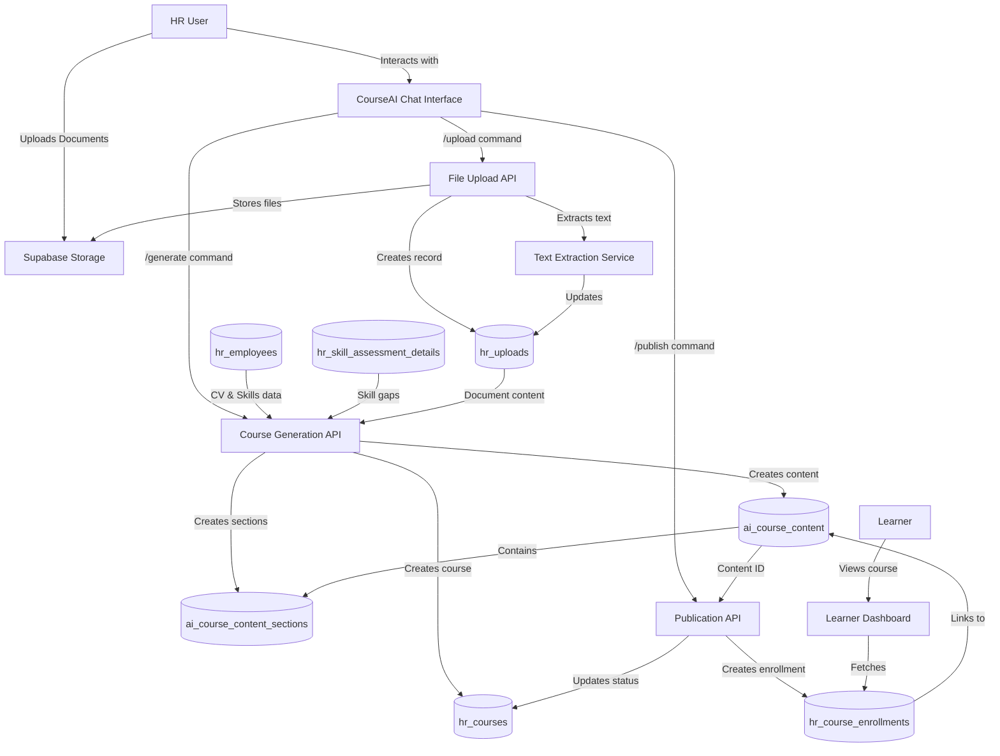

# CourseAI Enhancement Roadmap

## 1. Overview

This roadmap outlines the process of enhancing the CourseAI component to create full-featured course content based on employee profiles, skill gaps, and uploaded reference materials. The enhanced system will integrate with existing databases to generate, store, and deliver personalized learning content.

## 2. User Journey & System Architecture



## 3. Project Phases

### Phase 1: Database & Backend Setup (Week 1)

#### Tasks:
1. **Database Enhancement** (2 days)
   - Add `extracted_text`, `file_name`, `file_type` columns to `hr_uploads`
   - Create new tables `ai_course_content` and `ai_course_content_sections` with proper relationships
   - Add indexes for performance optimization on frequently queried columns

2. **API Endpoint Development** (3 days)
   - Create `/api/uploads` endpoint for file processing
   - Create `/api/courses/generate` endpoint for course generation
   - Create `/api/courses/publish` endpoint for course publishing

#### Dependencies:
- Access to database schema modification
- Supabase storage bucket for document storage

### Phase 2: Text Extraction Service (Week 2)

#### Tasks:
1. **File Format Support** (3 days)
   - Implement PDF text extraction using pdf.js or similar
   - Implement DOCX text extraction using mammoth.js
   - Implement PPTX text extraction via appropriate library

2. **Integration & Testing** (2 days)
   - Connect extraction service to upload endpoint
   - Test with various document types and sizes
   - Implement error handling and fallbacks

#### Dependencies:
- Document processing libraries
- File type detection capabilities

### Phase 3: Real Data Integration & AI Content Generation (Weeks 3-4)

#### Tasks:
1. **Real Data Schema Implementation** (2 days)
   - Define Zod schemas for all data structures used in course generation
   - Create TypeScript interfaces for end-to-end type safety
   - Implement database triggers for data consistency

2. **Supabase Query Optimization** (2 days)
   - Create optimized RLS policies for secure data access
   - Implement efficient join queries for employee skills and courses
   - Set up real-time subscriptions for data updates

3. **AI Model Integration** (3 days)
   - Connect to Groq API for course content generation
   - Create structured prompts using real employee data
   - Implement module/section content generation

4. **Context Assembly with Real Data** (2 days)
   - Implement direct Supabase queries for employee CV data and skills
   - Create weighted scoring system for skill gaps based on assessment data
   - Replace all mock resources with direct database lookups

5. **Verification & Testing** (2 days)
   - Implement validation for all data sources before AI processing
   - Create data integrity checks between related tables
   - Add automated tests for data flow correctness

#### Dependencies:
- Groq API access
- Complete Supabase schema with test data
- Access to production-like dataset for testing

### Phase 4: Frontend Enhancement (Week 5)

#### Tasks:
1. **Command Integration** (2 days)
   - Implement `/upload` command handler
   - Implement `/generate [title]` command handler
   - Implement `/publish` command handler

2. **UI Feedback Elements** (2 days)
   - Add upload progress indicators
   - Add generation status messages
   - Implement course preview in chat

3. **Help System** (1 day)
   - Add command documentation in welcome message
   - Implement contextual help for each stage

#### Dependencies:
- Backend APIs from Phases 1-3

### Phase 5: Testing & Deployment (Week 6)

#### Tasks:
1. **Integration Testing** (2 days)
   - Test end-to-end flow with real employee data
   - Verify course appearance in learner dashboard
   - Test with various document types and sizes

2. **Performance Optimization** (2 days)
   - Optimize file uploads for large documents
   - Implement request caching where appropriate
   - Add concurrency limits for multiple generations

3. **Deployment** (1 day)
   - Deploy to staging environment
   - Verify functionality in production context
   - Document deployment steps

#### Dependencies:
- Completion of Phases 1-4
- Access to staging/production environments

## 4. Design Principles

### UI/UX Guidelines
- **Conversational Interface**: Maintain the chat-based interaction model
- **Progressive Disclosure**: Show only relevant information at each stage
- **Contextual Feedback**: Provide clear status updates during long processes
- **Accessibility**: Ensure all interactions work with keyboard navigation and screen readers
- **Responsive Design**: Support both desktop and mobile views

### Component Architecture
- **Modular Design**: Separate concerns into distinct components and hooks
- **State Management**: Use React state for UI state, with Context for shared state
- **Custom Hooks**: Extract complex logic into reusable hooks
- **Prop Drilling Avoidance**: Use composition over deep prop passing

### Styling Standards
- **Tailwind CSS**: Utilize utility classes for consistent styling
- **Component Library**: Leverage shadcn/ui components for consistent UX
- **Dark/Light Mode**: Support system color scheme preferences
- **CSS Variables**: Use for theming and consistent spacing/colors

### Performance Practices
- **Lazy Loading**: Implement for file processing libraries
- **Debouncing**: Apply to high-frequency events like typing
- **Pagination**: Implement for displaying long lists of documents/courses
- **Image Optimization**: Use appropriate formats and sizes for thumbnails

## 5. Backend Guidelines

### Server Architecture
- **API Routes**: Implement as serverless functions
- **Middleware**: Use for authentication and request validation
- **Rate Limiting**: Apply to prevent API abuse
- **Response Caching**: Implement for repeated requests

### Data Storage
- **Supabase**: Primary database and storage solution
- **Database Design**: Follow normalization principles for relational data
- **Indexing**: Apply to frequently queried columns
- **Transactions**: Use for multi-step operations to ensure data integrity

### Security Measures
- **Input Validation**: Implement with Zod for all API inputs
- **Authentication**: Verify user permissions for all operations
- **File Validation**: Scan uploads for malware and verify MIME types
- **Rate Limiting**: Prevent excessive requests from single sources

### Integration Points
- **Frontend-Backend**: JSON API with typed responses
- **AI Services**: Structured prompts with error handling
- **File Storage**: Direct uploads with signed URLs
- **Database**: Type-safe queries with error handling

## 6. Optimized React Code Guidelines

### Performance Optimization

#### Avoid Unnecessary Renders

**Problematic:**
```tsx
// Creates a new object on every render
const ChatPanel = () => {
  const style = { padding: '20px', margin: '10px' };
  return <div style={style}>Chat content</div>;
};
```

**Optimized:**
```tsx
// Define styles outside component or use CSS classes
const panelStyle = { padding: '20px', margin: '10px' };
const ChatPanel = () => {
  return <div style={panelStyle}>Chat content</div>;
};
```

#### Memoize Expensive Calculations

**Problematic:**
```tsx
const CourseGenerator = ({ skillGaps }) => {
  // Recalculated on every render
  const prioritizedSkills = skillGaps.sort((a, b) => b.gap_level - a.gap_level);
  return <SkillList skills={prioritizedSkills} />;
};
```

**Optimized:**
```tsx
const CourseGenerator = ({ skillGaps }) => {
  // Only recalculated when skillGaps changes
  const prioritizedSkills = useMemo(
    () => skillGaps.sort((a, b) => b.gap_level - a.gap_level),
    [skillGaps]
  );
  return <SkillList skills={prioritizedSkills} />;
};
```

#### Stabilize Callback References

**Problematic:**
```tsx
const FileUploader = () => {
  const [files, setFiles] = useState([]);
  
  // New function reference on every render
  const handleUpload = (file) => {
    setFiles([...files, file]);
  };
  
  return <UploadButton onUpload={handleUpload} />;
};
```

**Optimized:**
```tsx
const FileUploader = () => {
  const [files, setFiles] = useState([]);
  
  // Stable function reference
  const handleUpload = useCallback((file) => {
    setFiles(prevFiles => [...prevFiles, file]);
  }, []);
  
  return <UploadButton onUpload={handleUpload} />;
};
```

#### Prevent Unnecessary Child Renders

**Problematic:**
```tsx
const CourseAI = () => {
  const [messages, setMessages] = useState([]);
  const [isLoading, setIsLoading] = useState(false);
  
  // ChatMessages re-renders on any state change
  return (
    <div>
      <ChatMessages messages={messages} />
      <LoadingIndicator isLoading={isLoading} />
    </div>
  );
};
```

**Optimized:**
```tsx
const CourseAI = () => {
  const [messages, setMessages] = useState([]);
  const [isLoading, setIsLoading] = useState(false);
  
  // ChatMessages only re-renders when messages change
  return (
    <div>
      <MemoizedChatMessages messages={messages} />
      <LoadingIndicator isLoading={isLoading} />
    </div>
  );
};

const MemoizedChatMessages = React.memo(ChatMessages);
```

### Component Structure Best Practices

1. **Single Responsibility Principle**
   - Each component should do one thing well
   - Extract complex logic into custom hooks
   - Separate UI and business logic

2. **Container/Presentation Pattern**
   - Separate data fetching from rendering
   - Use containers for state and effects
   - Use presentational components for UI

3. **Custom Hooks for Reusable Logic**
   - Extract file upload logic to `useFileUpload` hook
   - Create `useCourseGeneration` for generation logic
   - Implement `useCommandProcessor` for chat commands

4. **Component Composition**
   - Use children prop for flexible layouts
   - Implement compound components for related UI
   - Use render props for dynamic content

### Example Custom Hook for Real Data Integration

```tsx
// useCourseData.ts
export function useCourseData(employeeId: string) {
  const [courses, setCourses] = useState<Course[]>([]);
  const [skills, setSkills] = useState<Skill[]>([]);
  const [skillGaps, setSkillGaps] = useState<SkillGap[]>([]);
  const [isLoading, setIsLoading] = useState(true);
  const [error, setError] = useState<string | null>(null);
  
  useEffect(() => {
    async function fetchCourseData() {
      if (!employeeId) return;
      setIsLoading(true);
    setError(null);
    
    try {
        // Get the latest assessment ID for this employee
        const { data: assessmentRows, error: assessmentError } = await supabase
          .from('hr_skill_assessments')
          .select('id')
          .eq('employee_id', employeeId)
          .order('assessed_at', { ascending: false })
          .limit(1);
          
        if (assessmentError) throw assessmentError;
        
        if (!assessmentRows?.length) {
          setCourses([]);
          setSkills([]);
          setSkillGaps([]);
          return;
        }
        
        const assessmentId = assessmentRows[0].id;
        
        // Parallel queries for better performance
        const [coursesResponse, skillsResponse, gapsResponse] = await Promise.all([
          // Get employee's enrolled courses
          supabase
            .from('hr_course_enrollments')
            .select(`
              id,
              course_id,
              status,
              progress,
              hr_courses (
                id,
                title,
                description,
                estimated_duration,
                difficulty_level
              )
            `)
            .eq('employee_id', employeeId),
            
          // Get employee's skills
          supabase
            .from('hr_skill_assessment_details')
            .select(`
              skill_name,
              proficiency_level,
              gap_level
            `)
            .eq('assessment_id', assessmentId)
            .eq('is_missing', false),
            
          // Get employee's skill gaps
          supabase
            .from('hr_skill_assessment_details')
            .select(`
              skill_name,
              gap_level
            `)
            .eq('assessment_id', assessmentId)
            .eq('is_missing', true)
        ]);
        
        // Handle errors
        if (coursesResponse.error) throw coursesResponse.error;
        if (skillsResponse.error) throw skillsResponse.error;
        if (gapsResponse.error) throw gapsResponse.error;
        
        // Process and set the data
        setCourses(
          (coursesResponse.data || []).map(enrollment => ({
            id: enrollment.course_id,
            title: enrollment.hr_courses?.title || `Course ${enrollment.course_id.substring(0, 8)}`,
            description: enrollment.hr_courses?.description || '',
            estimatedDuration: enrollment.hr_courses?.estimated_duration,
            difficultyLevel: enrollment.hr_courses?.difficulty_level,
            status: enrollment.status,
            progress: enrollment.progress || 0
          }))
        );
        
        setSkills(
          (skillsResponse.data || []).map(skill => ({
            name: skill.skill_name,
            proficiencyLevel: skill.proficiency_level,
            gapLevel: skill.gap_level,
            isMissing: false
          }))
        );
        
        setSkillGaps(
          (gapsResponse.data || []).map(gap => ({
            name: gap.skill_name,
            gapLevel: gap.gap_level,
            isMissing: true
          }))
        );
    } catch (err) {
        console.error('Error fetching course data:', err);
        setError(err instanceof Error ? err.message : 'Unknown error occurred');
    } finally {
        setIsLoading(false);
    }
    }
    
    fetchCourseData();
  }, [employeeId]);
  
  return {
    courses,
    skills,
    skillGaps,
    isLoading,
    error,
    refetch: () => {
      setIsLoading(true);
      // Re-execute the effect
      const noop = () => {};
      noop();
    }
  };
}
```
