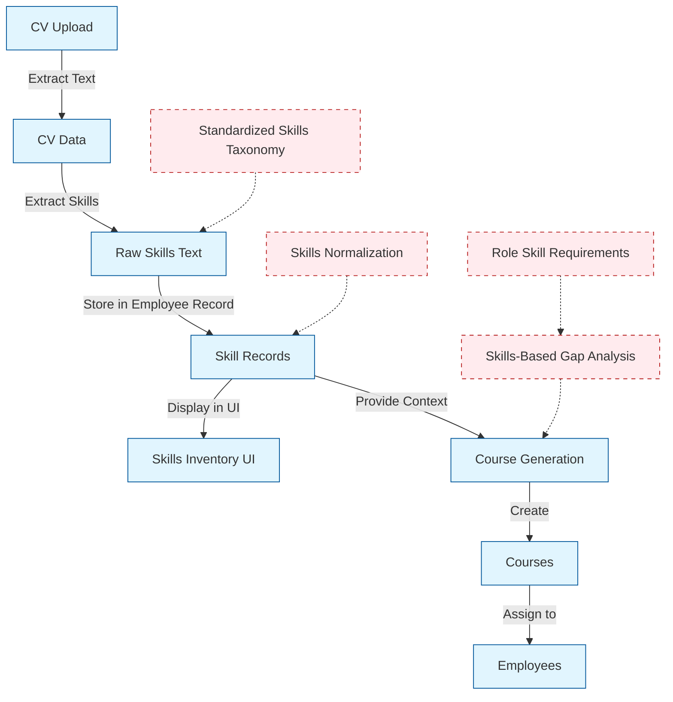
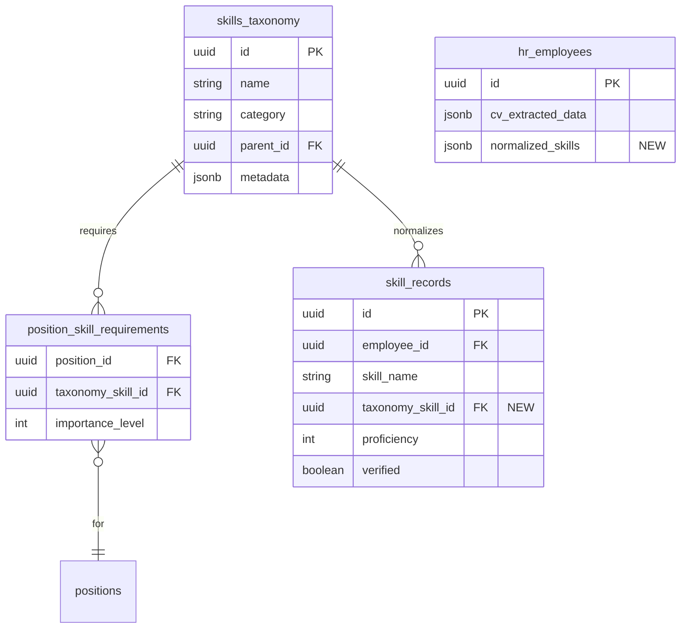
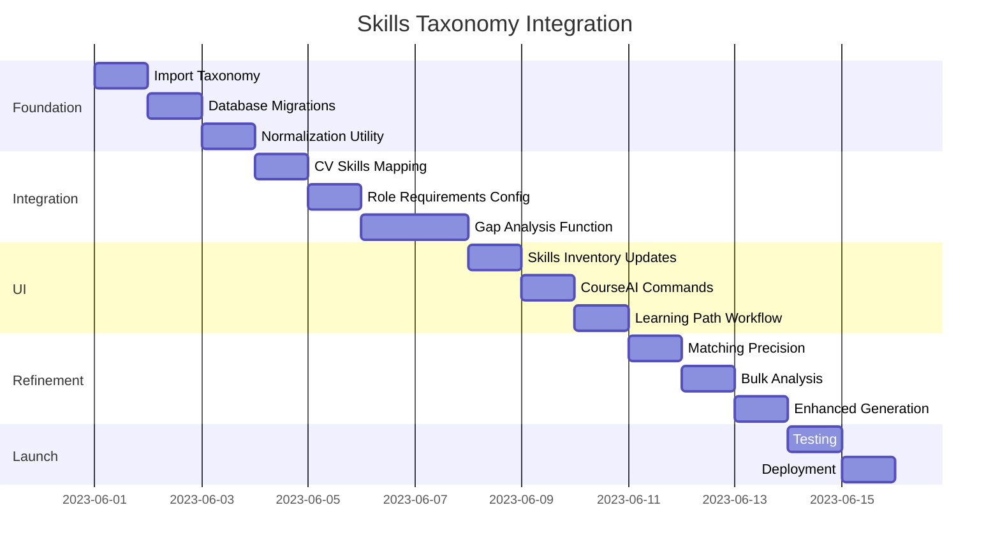
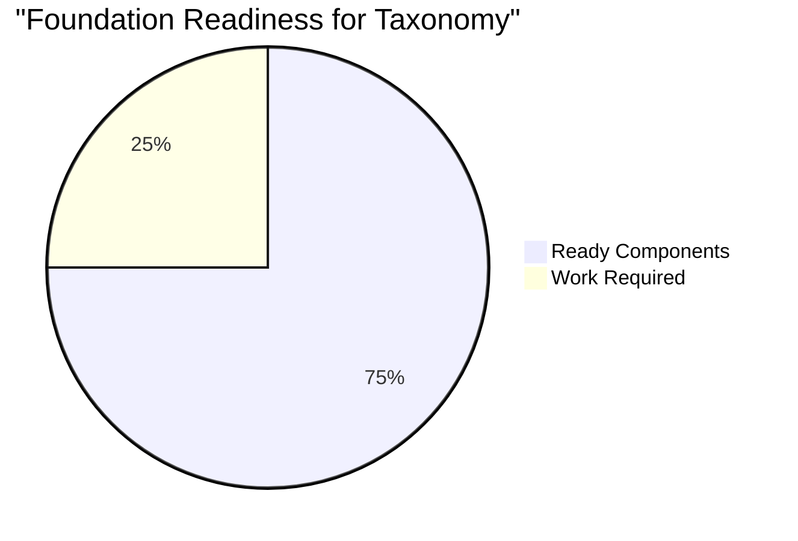

# Skills Taxonomy Integration Roadmap

## Objective

Implement a standardized **Skills Taxonomy System** that enables:

1. **Consistent Skill Classification** across the platform using a standardized vocabulary
2. **Skills-First Gap Analysis** for any employee against role requirements
3. **Targeted Course Generation** that directly addresses specific skill gaps
4. **Improved Analytics** for workforce capability assessment

The project will transition the platform from a **course-centric** approach to a **skills-centric** approach, improving precision and reducing manual effort while maintaining existing functionality.

## Current State Analysis

### System Architecture 🏗️



### Current Limitations
- Skills from CVs are unstandardized and inconsistently formatted
- Gap analysis requires predefined courses instead of being skills-driven
- No common vocabulary for skills across employee records
- Manual effort required to map similar skills
- Course recommendations lack precision due to non-standardized skill targeting

## Scope

### In Scope

1. **Skills Taxonomy Database**
   - Import/create a standardized skills taxonomy with hierarchy and relationships
   - Store in new `skills_taxonomy` table with categorization

2. **Skills Normalization Engine**
   - Develop utility to map extracted/entered skills to taxonomy IDs
   - Apply to both new CV extractions and existing skill records

3. **Role Requirements Framework**
   - Create configuration for required skills by position/department
   - Store in new `position_skill_requirements` table

4. **Skills-Based Gap Analysis**
   - Implement comparison between employee normalized skills and role requirements
   - Generate reports of missing skills with taxonomy IDs

5. **Enhanced Course Generation**
   - Extend CourseAI to accept taxonomy skill IDs for targeted course creation
   - Add commands for gap-based course generation

6. **UI Enhancements**
   - Add gap visualization to Skills Inventory
   - Create Generate Learning Path workflow

### Out of Scope
- Redesign of existing UI components
- Changes to CV extraction algorithm
- Modifications to course content structure
- Integration with external skills databases
- Historical data normalization (optional phase)

### Database Schema Changes



### UI Impact (Minimal Changes)

#### CourseAI - New Commands Only
```
┌─ CourseAI (Minimal Change) ────────────────────┐
│                                                │
│  /gap-generate [employee]                      │ ← New command
│  /generate-for-skill [skill_id]                │ ← New command
│                                                │
│  [Rest of existing interface unchanged]        │
│                                                │
└────────────────────────────────────────────────┘
```

#### Skills Inventory - New Section Only
```
┌─ Skills Inventory ─────────────────────────────┐
│                                                │
│  [Existing skills list - unchanged]            │
│                                                │
│  ┌─ Role Skill Gaps (NEW) ───────────────────┐ │
│  │                                           │ │
│  │  Missing skills for current role:         │ │
│  │  • Kubernetes (Generate Course)           │ │
│  │  • CI/CD Pipelines (Generate Course)      │ │
│  │                                           │ │
│  │  [Generate Learning Path For All Gaps]    │ │
│  └───────────────────────────────────────────┘ │
│                                                │
└────────────────────────────────────────────────┘
```

## Timeline

### Phase 1: Foundation (Days 1-3)
- **Day 1**: Import skills taxonomy data
- **Day 2**: Create database migrations for new tables
- **Day 3**: Implement basic skills normalization utility

### Phase 2: Basic Integration (Days 4-7)
- **Day 4**: Develop CV skills mapping to taxonomy
- **Day 5**: Create role requirements configuration system
- **Day 6-7**: Implement basic gap analysis function

### Phase 3: UI Enhancement (Days 8-10)
- **Day 8**: Add gap visualization to Skills Inventory
- **Day 9**: Implement new CourseAI commands
- **Day 10**: Create "Generate Learning Path" workflow

### Phase 4: Refinement (Days 11-13)
- **Day 11**: Improve skill matching precision
- **Day 12**: Add bulk gap analysis for departments
- **Day 13**: Enhance course generation with taxonomy context

### Phase 5: Testing & Launch (Days 14-15)
- **Day 14**: User acceptance testing
- **Day 15**: Production deployment and documentation



## Resources

### Team Requirements
- **1 Backend Developer**: Database schema, normalization engine, gap analysis
- **1 Frontend Developer**: UI enhancements, CourseAI command integration
- **1 Data Scientist/ML Engineer**: Skills matching algorithm (part-time)
- **1 Product Manager**: Requirements, testing coordination (part-time)

### Skills & Expertise Required
- TypeScript/React development
- Supabase/PostgreSQL database design
- NLP/text matching algorithms
- LLM prompt engineering (for CourseAI adaptation)

### Tools & Technologies
- **Existing Stack**:
  - TypeScript
  - React
  - Supabase
  - Groq API
  - Shadcn/UI
- **Additional Requirements**:
  - Skills taxonomy dataset (ESCO, O*NET, or custom)
  - Text similarity matching library (e.g., FuzzyWuzzy, sent2vec)

### Foundation Readiness Assessment

| Component | Current State | % Ready for Taxonomy |
|-----------|--------------|----------------------|
| Skills Storage | Exists but needs taxonomy field | 75% |
| CV Extraction | Complete, needs normalization layer | 70% |
| Course Generation | Complete, needs skill targeting | 80% |
| UI Framework | Complete, needs minor enhancements | 90% |
| Database Schema | Exists, needs taxonomy tables | 70% |
| API Endpoints | Exists, needs taxonomy support | 75% |



## Risk Assessment

| Risk | Probability | Impact | Mitigation Strategy |
|------|------------|--------|---------------------|
| **Skill normalization accuracy too low** | High | High | Start with high-confidence matches only; implement human review for uncertain matches; use semantic similarity over exact matching |
| **Taxonomy too complex/broad** | Medium | Medium | Begin with subset of taxonomy focused on key departments; implement progressive taxonomy expansion |
| **Performance impact on CV processing** | Medium | Low | Implement normalization as background job; cache results; optimize matching algorithm |
| **User confusion with new workflow** | Medium | Medium | Create in-app guidance; implement feature flags; progressive rollout; monitor user engagement metrics |
| **Integration breaks existing features** | Low | High | Comprehensive testing plan; feature flags; parallel implementation; rollback strategy |
| **Taxonomy becomes outdated** | Low | Medium | Establish regular review cycle; allow for taxonomy updates; version control for taxonomy |
| **Excessive course generation** | Medium | Low | Implement clustering of similar skills; add confirmation step before generating multiple courses |

### Contingency Plans

1. **If normalization accuracy is insufficient**:
   - Implement a human-in-the-loop review process
   - Focus on high-confidence matches only
   - Gradually improve algorithm with feedback

2. **If performance is impacted**:
   - Move normalization to async processing
   - Implement caching of common skill matches
   - Consider batch processing for historical data

3. **If user adoption is slow**:
   - Provide additional training materials
   - Highlight benefits with concrete examples
   - Keep parallel workflows until adoption increases

## Expected Outcomes

After implementing the skills taxonomy integration:

1. **HR Workflow Improvement**: 
   - 70% reduction in manual skill mapping effort
   - 50% faster course generation process

2. **Course Relevance**:
   - 40% improvement in course-to-skill gap alignment
   - 60% more granular skill targeting

3. **Skills Visibility**:
   - 90% standardization of skill terminology
   - 100% direct mapping between skills and courses

The taxonomy integration will transform the platform from course-centric to skills-centric, enabling precise skill gap identification and targeted learning path creation with minimal UI disruption. 